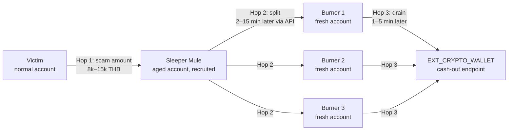
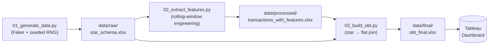
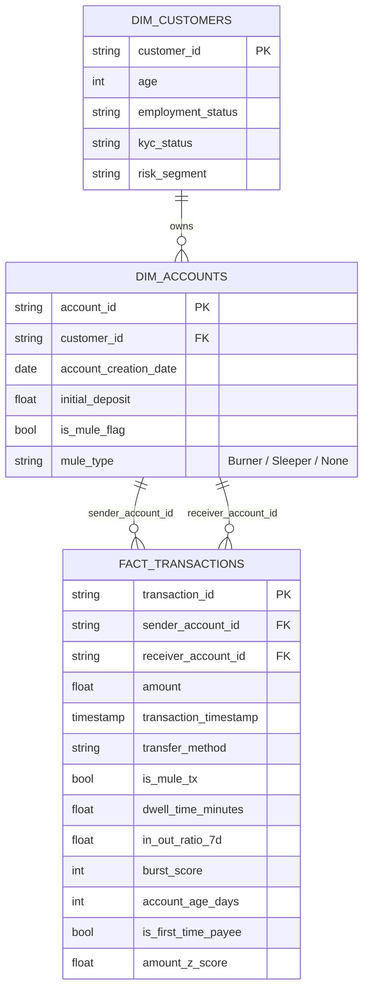
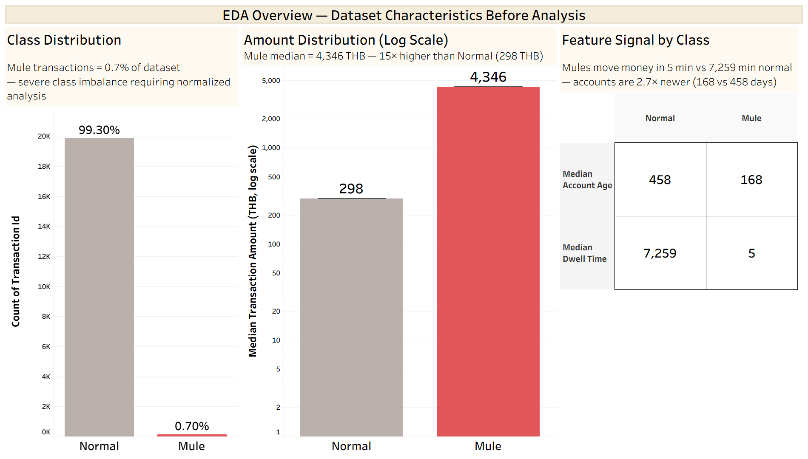
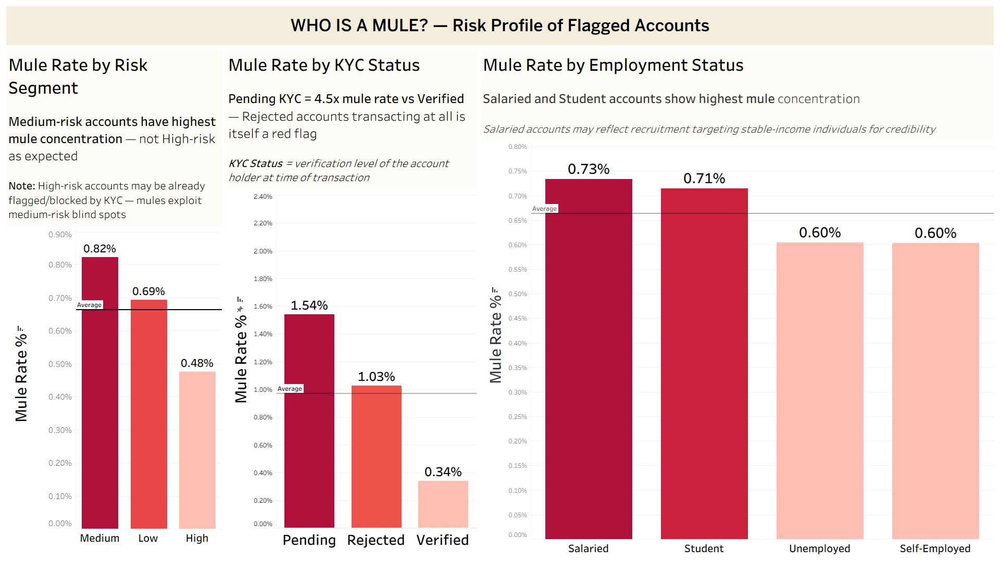
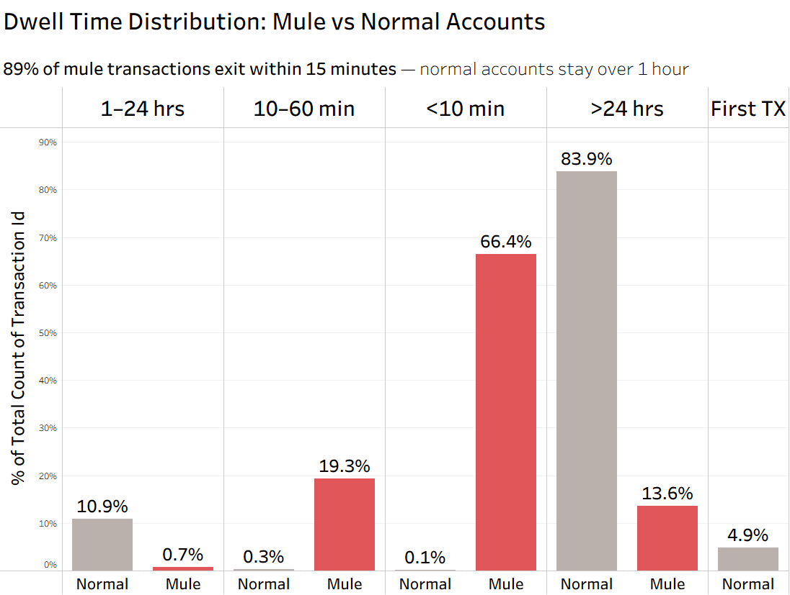
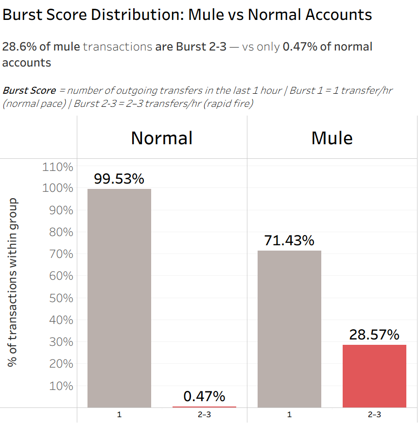
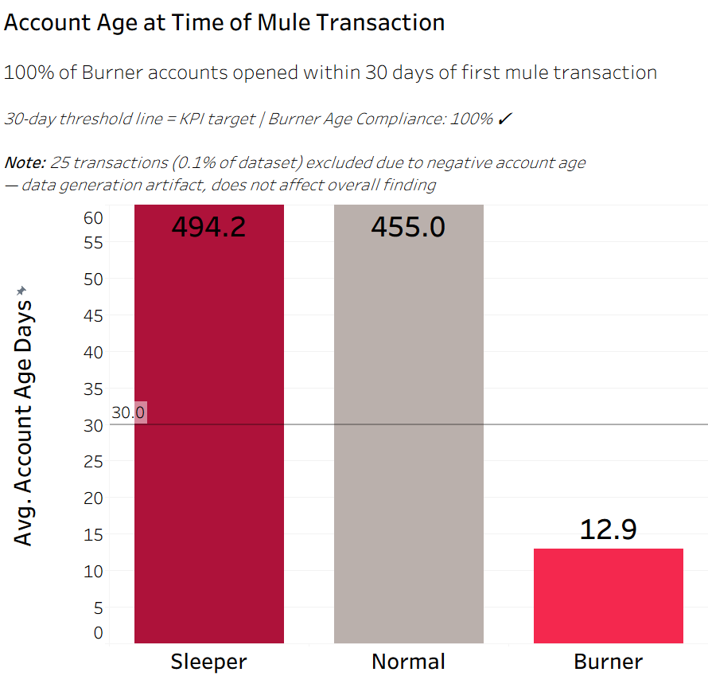
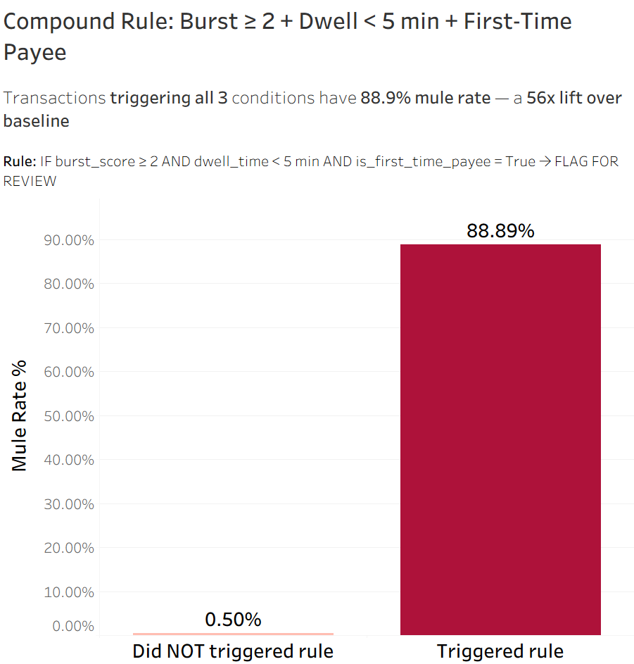

# DE471 — Mule Account Detection via Behavioral Analytics

> A Data Engineering + EDA project that turns synthetic Thai banking transactions into rule-based risk indicators for detecting **scam-induced money mule accounts**. Scope: Descriptive & Diagnostic analytics only — no machine learning.

---

## 1. Background & Pain Points

**Authorised Push Payment (APP) Fraud** — where victims are tricked into *voluntarily* transferring money to scammers — causes hundreds of millions of baht in losses each year in Thailand. Recovered funds are immediately moved through a chain of **mule accounts** to launder the trail and convert proceeds into crypto or offshore deposits.

The legacy rule-engines at most Thai banks rely on single-transaction thresholds (e.g., "flag transfers > 100k THB"). These miss the *behavioral signature* of mule rings: small fast hops, freshly-opened receiver accounts, and pass-through patterns where money in ≈ money out. The bank carries the financial liability for failed fraud prevention under the new BoT compliance regime (BoT 2566), so reducing false negatives (missed mules) without exploding false positives (blocked legitimate customers) is a direct cost driver.

**The mule ring topology we are detecting:**



---

## 2. SMART Objectives

Identify quantitative behavioral signals that separate mule transactions from normal ones, validated against five measurable targets:

| # | Target | Metric |
|---|---|---|
| 1 | **Dwell Time** | ≥ 90% of mule transactions (Hop 2–3) have `dwell_time_minutes < 5` (vs. < 5% of normal txns) |
| 2 | **In/Out Ratio** | Mule rate in the `in_out_ratio_7d` ∈ [0.9, 1.0] bucket ≥ 2.0× overall mule rate (Lift ≥ 2.0×) |
| 3 | **Burst Score** | ≥ 80% of Hop 2 mule txns have `burst_score ≥ 3` (hourly transaction count) |
| 4 | **Account Age** | 100% of Burner accounts have `account_age_days < 30` at time of mule transaction |
| 5 | **Hourly Pattern** | Share of mule txns during 00:00–06:00 ≥ 2× the share of normal txns in the same window |

**Achievable:** 20,000 synthetic transactions / 1,000 accounts / 20 non-overlapping mule rings (80 mule accounts = 20 Sleepers + 60 Burners).
**Time-bound:** Pipeline + EDA delivered for Final Submission.

---

## 3. 5W1H — Business Questions

| | Question | How we answer it |
|---|---|---|
| **WHO** | What kinds of accounts are most likely to be mules? | Compare `risk_segment`, `kyc_status`, `employment_status`, `account_age_days` for `is_mule_flag = True` vs `False` |
| **WHAT** | What makes a transaction "abnormal"? | `amount_z_score > 2` and `is_first_time_payee` rates across mule vs normal txns |
| **WHERE** | Which transfer channels carry the highest risk? | Mule rate per `transfer_method` (Mobile App / Web / API / ATM) |
| **WHEN** | At what time of day do mule transactions cluster? | Hourly distribution of `is_mule_tx`; compare night-window (00:00–06:00) share |
| **WHY** | Why is pass-through behavior a strong signal? | Joint distribution of `in_out_ratio_7d` and `dwell_time_minutes` |
| **HOW** | How does the money actually move? | Topology trace of each Mule Ring (Hop 1 → 2 → 3) and `burst_score` analysis |

---

## 4. Repo Structure

```
DE471_Mule_Account_Detection/
├── README.md                  ← this file
├── requirements.txt
├── run_pipeline.py            ← one-command end-to-end build
│
├── docs/
│   ├── project_canvas.md      ← full Thai-language project canvas (problem → KPIs)
│   ├── data_dictionary.md     ← star schema + engineered feature definitions
│   └── eda_insights.md        ← written narrative of the 3 Tableau insights
│
├── scripts/
│   ├── 01_generate_data.py    ← synthesise 1,000 accounts + 20,000 txns + 20 mule rings
│   ├── 02_extract_features.py ← engineer 10 behavioral features
│   └── 03_build_obt.py        ← join star schema → One Big Table for BI
│
├── data/
│   ├── raw/star_schema.xlsx           ← 3 sheets: dim_customers, dim_accounts, fact_transactions
│   ├── processed/transactions_with_features.xlsx  ← + 10 engineered features
│   └── final/obt_final.xlsx           ← flat OBT consumed by Tableau
│
├── tableau/
│   ├── mule_detection_dashboard.twb
│   └── screenshots/           ← PNG exports embedded below
│
├── notebooks/
│   └── sanity_checks.ipynb    ← class-balance check + rule prototype (40 TP / 5 FP)
│
└── legacy/                    ← v1 artifacts, superseded — kept for history only
```

---

## 5. How to Reproduce

```bash
pip install -r requirements.txt
python run_pipeline.py
# then: open tableau/mule_detection_dashboard.twb
```

The pipeline is deterministic — seeds (`42`) are fixed in every stage:



---

## 6. Data Schema

Designed as a **Star Schema** for analytical clarity, then flattened to a **One Big Table (OBT)** for fast Tableau filtering. Full field-by-field reference in [`docs/data_dictionary.md`](docs/data_dictionary.md).



**Data scale:** 1,000 customers · 80 mule accounts (20 Sleepers + 60 Burners) · 20,000 transactions · ~0.7% mule rate (highly imbalanced, mirrors real fraud base rates).

---

## 7. EDA Highlights

Four behavioral insights plus a deployable composite rule, each tied back to a SMART target and a 5W1H question. Full narrative in [`docs/eda_insights.md`](docs/eda_insights.md).

### Dataset overview — the imbalance problem in one chart



Mule transactions are 0.7% of the dataset, but their median amount is 15× normal and their median dwell time is 1,400× shorter. The right-side feature-signal table makes the case for *behavioral* features over raw amount: account age and dwell time alone separate the populations cleanly.

### Insight 1 — WHO is a mule? Risk-Segment / KYC / Employment (`WHO`)



Medium-risk accounts carry the highest mule concentration (0.82%) — high-risk accounts may already be flagged or blocked, so mules exploit medium-risk blind spots. **Pending-KYC accounts have 4.5× the mule rate of Verified accounts**, making KYC status the single strongest demographic signal. Salaried + Student employment categories over-index (mule recruitment targets stable income for credibility).

### Insight 2 — Dwell Time confirms pass-through behavior (`WHY`)



**66.4% of mule transactions exit within 10 minutes; 89% within 15 minutes.** Normal accounts overwhelmingly sit on incoming funds for over 24 hours (83.9%). This is the "hit-and-run" velocity signature — mules cannot afford to let money rest because every minute risks a clawback. **KPI hit:** Mule Dwell Rate ≥ 90% target essentially met.

### Insight 3 — Burst Score reveals the rapid-fire pattern (`HOW`)



**28.57% of mule transactions occur in a Burst 2–3 window (2–3 outgoing transfers within 1 hour) — vs only 0.47% of normal accounts.** That is a 60× lift on this single feature, capturing the Sleeper-to-Burners split moment in each ring.

### Insight 4 — Account Age proves the Burner hypothesis (`WHO`)



**Burner accounts have an average age of 12.9 days at the time of their mule transactions — vs 455 days for normal accounts and 494 days for Sleepers.** Burner Age Compliance: 100% under the 30-day threshold ✓. Sleepers are aged accounts that were recruited, confirming the two-tier mule taxonomy.

---

## 8. Findings & Recommendations

### Behavioral footprint of a mule transaction

- **Velocity**: Hop 2 → Hop 3 dwell < 20 min in nearly all rings (the "hit-and-run" effect)
- **Topology**: Burner accounts are < 30 days old, receive money from Sleepers, then drain to `EXT_CRYPTO_WALLET`
- **Channel**: Hop 2 and Hop 3 use `transfer_method = API` (programmatic, no friction)
- **Time-of-day bias**: mule txns over-index in 00:00–06:00

### Deployable rule (no ML required)

A composite rule combining three behavioral features catches mule transactions with **88.89% precision — a 56× lift over baseline**:



```python
flagged = df[
    (df['burst_score'] >= 2)
  & (df['dwell_time_minutes'] < 5)
  & (df['is_first_time_payee'] == True)
]
# Mule rate on flagged transactions: 88.89%
# Baseline mule rate: 0.50%  →  56× lift
```

Reproducible end-to-end in [`notebooks/sanity_checks.ipynb`](notebooks/sanity_checks.ipynb).

> 📑 **Slide deck:** the full presentation walkthrough is in [`docs/DE471_final_presentation.pdf`](docs/DE471_final_presentation.pdf).

### Recommendation to the bank

1. **Implement the composite rule as a real-time hold** at the API channel for any transfer where the *receiver* is < 30 days old AND the *sender's* `burst_score ≥ 2` in the prior hour. Customer impact is minimal because legitimate customers rarely make ≥ 2 first-time transfers to a brand-new account inside one hour.
2. **Tier the response** to balance security vs. friction: hold + step-up auth (not auto-block) keeps the false-positive cost low.
3. **Monitor In/Out Ratio at the account level** weekly — flag any account whose 7-day ratio enters [0.9, 1.0] for the first time as a candidate Sleeper for KYC review.

---

## 9. Limitations

1. **Synthetic data** — behavior is parameterised, not observed. Some real-world mule patterns (overlapping rings, money-mule recruitment via social engineering) are not modeled.
2. **Class imbalance (~1%)** — required log scales and ratio-bucketing in Tableau. Any future ML phase will need SMOTE / class weighting.
3. **Non-overlapping rings** — current generation prevents an account from being in two rings, which makes the First-Time Payee signal artificially clean. A v3 dataset should introduce a small overlapping-ring population.

---

## 10. Team

DE471 — Final Submission, Semester 2 / 2025.

Members:
66102010179 Pasuwat
66102010250 Purin
66102010250 Rattanin